# sln-109.01.2004-music.explorer

109.01.2004 ~ 1.year : 109.studio

## solution
*knowledge-management*, *media-player*, *file-manager*, *file-sharing*, *social-network*, *application*, *software*, *database*, *enterprise*, *information-management-system* ~ *client-server*, *thin-client*, *p2p*, *web-browser*, *windows-2k*, *linux*, *apache-2*, *mysql-5*, *php-5*, *sql*, *view*, *stored-proc*, *javascript*, *html*, *css*, *object-pascal*, *delphi-7*

## project
- *2004* - [Music Explorer](@project/Studio109)

## prototype
- *2026* - [Lovable](https://studio109.lovable.app)
- *2026* - [Replit](https://studio109-app.replit.app)
- *2026* - [Figma](https://studio109.figma.site)

## demo
|form|code|
|:---:|---:|
|<a href="@resource/@screenshot/01-studio109.v1-Login.jpg">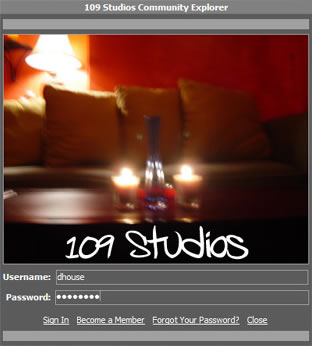</a>|frm_Splash : [pas](@project/Studio109/frm_Splash.pas) ~ [dfm](@project/Studio109/frm_Splash.dfm)|
|<a href="@resource/@screenshot/02-studio109.v1-About.jpg">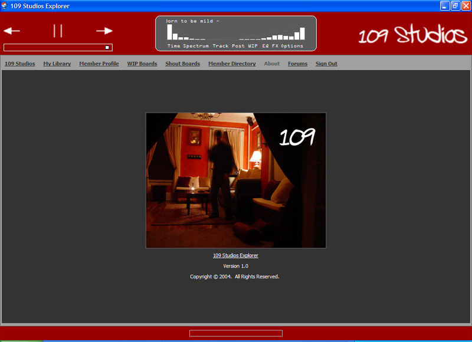</a>|frm_About : [pas](@project/Studio109/frm_About.pas) ~ [dfm](@project/Studio109/frm_About.dfm)|
|<a href="@resource/@screenshot/03-studio109.v1-109_Music1.jpg">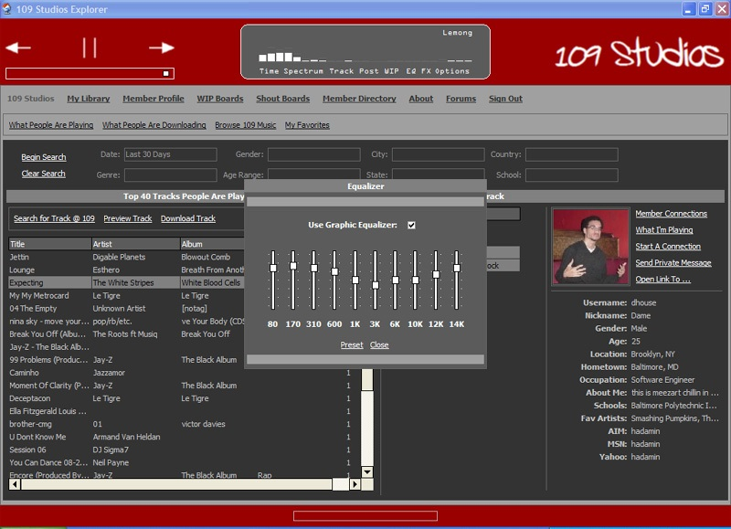</a>|frm_EqualizerDLG : [pas](@project/Studio109/frm_EqualizerDLG.pas) ~ [dfm](@project/Studio109/frm_EqualizerDLG.dfm)|
|<a href="@resource/@screenshot/04-studio109.v1-109_Music2.jpg">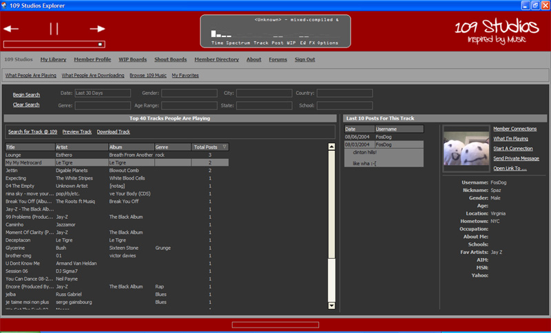</a>|frm_109Music : [pas](@project/Studio109/frm_109Music.pas) ~ [dfm](@project/Studio109/frm_109Music.dfm)|
|<a href="@resource/@screenshot/05-studio109.v1-109_Music3.jpg">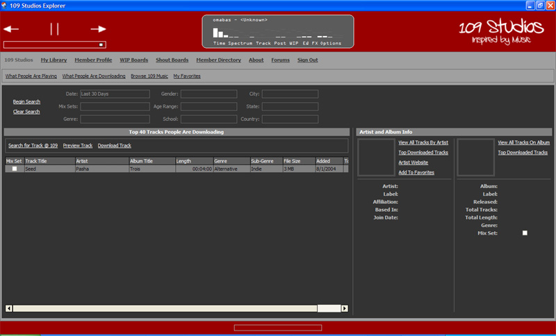</a>|frm_109Music : [pas](@project/Studio109/frm_109Music.pas) ~ [dfm](@project/Studio109/frm_109Music.dfm)|
|<a href="@resource/@screenshot/06-studio109.v1-109_Music4.jpg">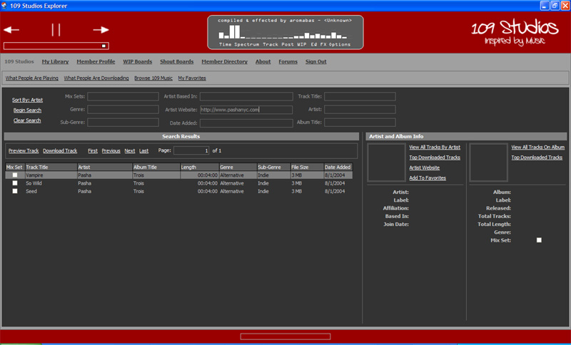</a>|frm_109Music : [pas](@project/Studio109/frm_109Music.pas) ~ [dfm](@project/Studio109/frm_109Music.dfm)|
|<a href="@resource/@screenshot/07-studio109.v1-109_MyLibrary.jpg">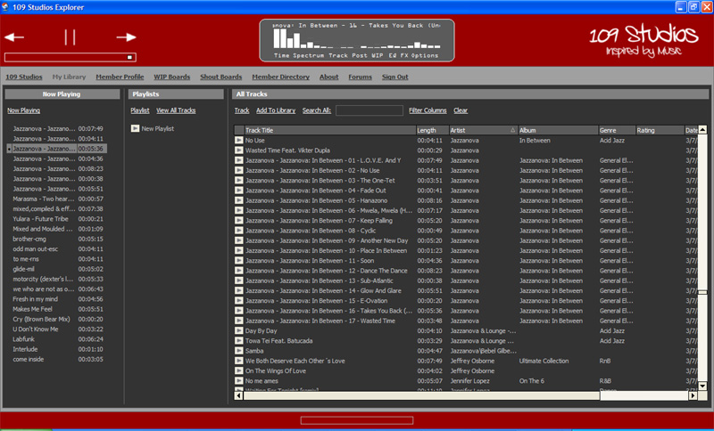</a>|frm_Music : [pas](@project/Studio109/frm_Music.pas) ~ [dfm](@project/Studio109/frm_Music.dfm)|
|<a href="@resource/@screenshot/08-studio109.v1-109_Con1.jpg">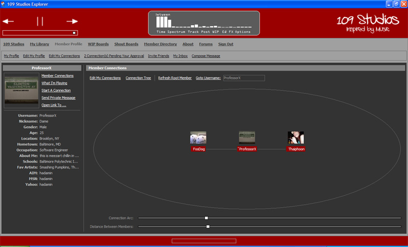</a>|frm_MemberProfile : [pas](@project/Studio109/frm_MemberProfile.pas) ~ [dfm](@project/Studio109/frm_MemberProfile.dfm)|
|<a href="@resource/@screenshot/09-studio109.v1-109_Con2.jpg">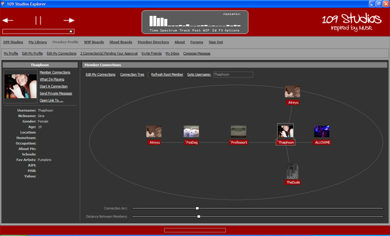</a>|frm_MemberProfile : [pas](@project/Studio109/frm_MemberProfile.pas) ~ [dfm](@project/Studio109/frm_MemberProfile.dfm)|
|<a href="@resource/@screenshot/10-studio109.v1-109_Con3.jpg">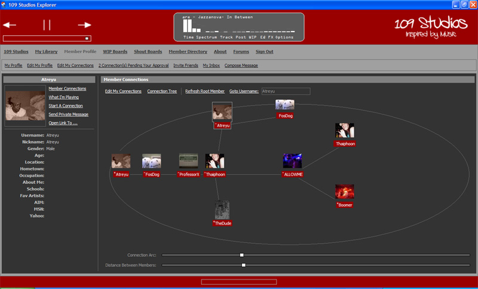</a>|frm_MemberProfile : [pas](@project/Studio109/frm_MemberProfile.pas) ~ [dfm](@project/Studio109/frm_MemberProfile.dfm)|
|<a href="@resource/@screenshot/11-studio109.v1-109_Con4.jpg">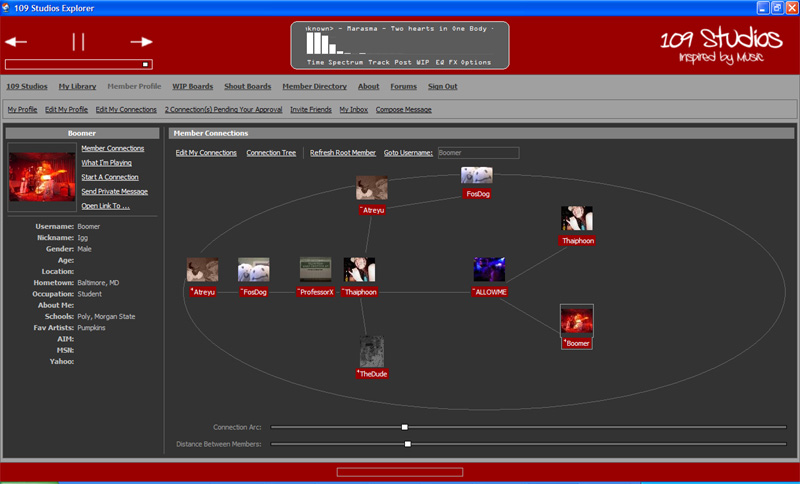</a>|frm_MemberProfile : [pas](@project/Studio109/frm_MemberProfile.pas) ~ [dfm](@project/Studio109/frm_MemberProfile.dfm)|
|<a href="@resource/@screenshot/13-studio109.v1-109_WIPBoards1.jpg">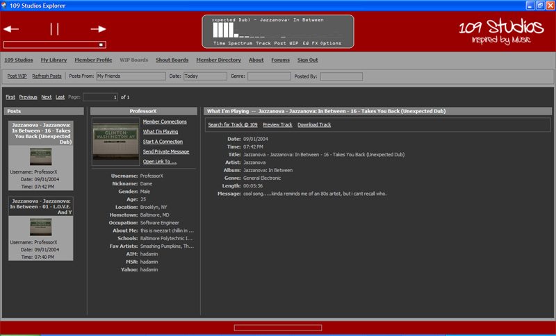</a>|frm_WAYLT : [pas](@project/Studio109/frm_WAYLT.pas) ~ [dfm](@project/Studio109/frm_WAYLT.dfm)|
|<a href="@resource/@screenshot/15-studio109.v1-109_WIPBoards3.jpg">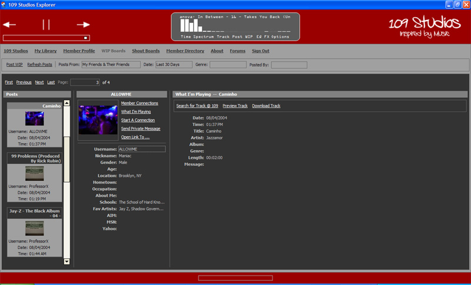</a>|frm_WAYLT : [pas](@project/Studio109/frm_WAYLT.pas) ~ [dfm](@project/Studio109/frm_WAYLT.dfm)|
|<a href="@resource/@screenshot/18-studio109.v1-109_BB.jpg">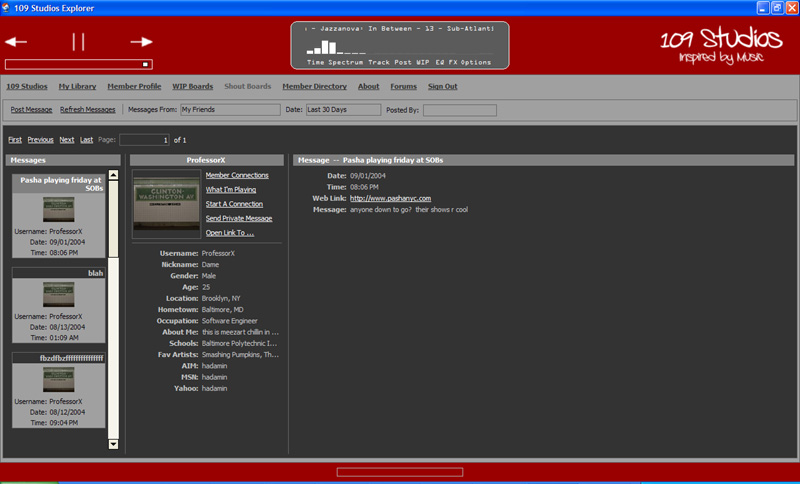</a>|frm_BulletinBoard : [pas](@project/Studio109/frm_BulletinBoard.pas) ~ [dfm](@project/Studio109/frm_BulletinBoard.dfm)|
|<a href="@resource/@screenshot/19-studio109.v1-109_SearchForMembers.jpg">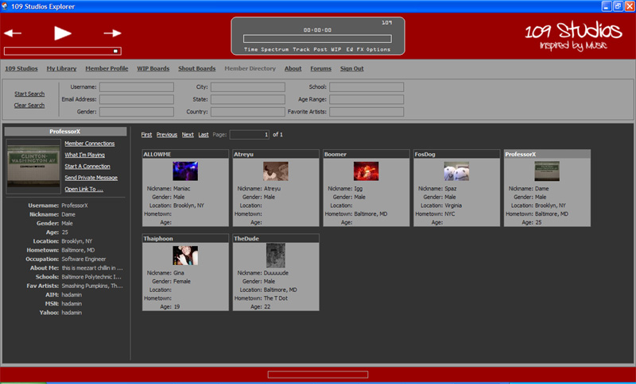</a>|frm_MemberDirectory : [pas](@project/Studio109/frm_MemberDirectory.pas) ~ [dfm](@project/Studio109/frm_MemberDirectory.dfm)|
|<a href="@resource/@screenshot/21-studio109.v1-109_MemProfile2.jpg">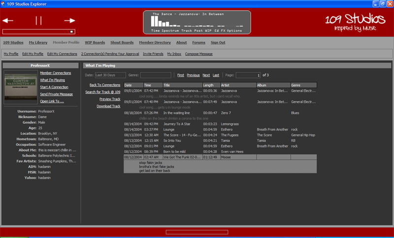</a>|frm_MemberProfile : [pas](@project/Studio109/frm_MemberProfile.pas) ~ [dfm](@project/Studio109/frm_MemberProfile.dfm)|
|<a href="@resource/@screenshot/22-studio109.v1.jpg">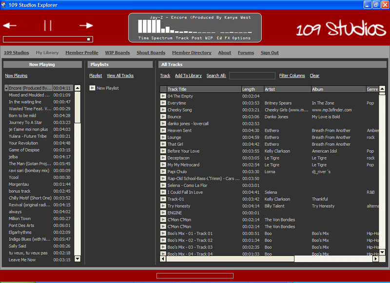</a>|frm_Music : [pas](@project/Studio109/frm_Music.pas) ~ [dfm](@project/Studio109/frm_Music.dfm)|
|<a href="@resource/@screenshot/23-studio109.v1.jpg">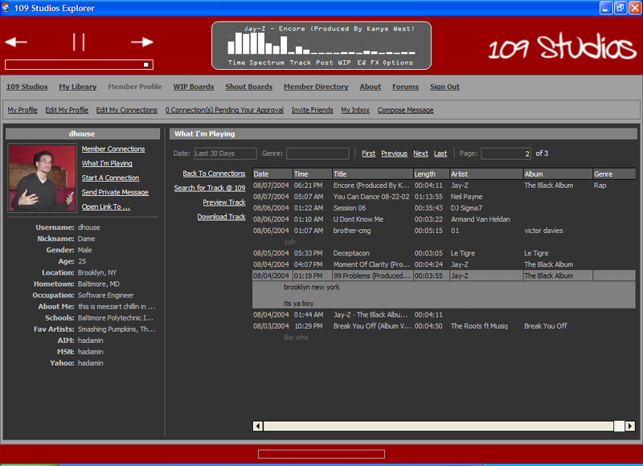</a>|frm_MemberProfile : [pas](@project/Studio109/frm_MemberProfile.pas) ~ [dfm](@project/Studio109/frm_MemberProfile.dfm)|

## resource
- [model](@resource/@model)
- [screenshot](@resource/@screenshot)